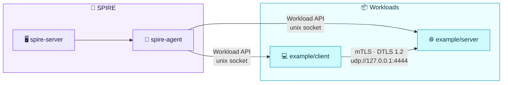

# spiffe-dtls

A proof-of-concept Go library that brings SPIFFE workload identity to UDP via DTLS mutual authentication.

## Overview

The package prototypes two functions that mirror the `go-spiffe` TLS helper API:

```go
dtlssvid.MTLSClientConfig(svid, bundle, authorizer) (*dtls.Config, error)
dtlssvid.MTLSServerConfig(svid, bundle, authorizer) (*dtls.Config, error)
```

Both return a [`pion/dtls`](https://github.com/pion/dtls) config wired up to:

- Fetch a X.509-SVID from the SPIFFE Workload API for every handshake,
- Verify the peer's certificate chain using `x509svid.ParseAndVerify` against the trust bundle, replacing `pion`'s built-in TLS verification,
- Apply a SPIFFE authorizer (e.g. `AuthorizeAny`, `AuthorizeID`, `AuthorizeMemberOf`) after chain verification, so identity policy is enforced at the application layer,

The result is mutual DTLS 1.2 where both peers are identified by their SPIFFE ID, backed by a live SPIRE agent.

## Schematic



## Running the example

The `example/` directory contains a paired server and client. The server accepts a single datagram, logs the sender's SPIFFE ID, and echoes the message back. The client sends `"hello from SPIFFE-over-DTLS"` and prints the response.

### Prerequisites

- [Just](https://github.com/casey/just)

### Usage

```
just spire-up
just run
...
just spire-down
```

```
server: listening on 127.0.0.1:4444 (DTLS/SPIFFE)
client: our SPIFFE ID: spiffe://example.org/workload
server: peer=spiffe://example.org/workload msg="hello from SPIFFE-over-DTLS"
client: server response: echo: hello from SPIFFE-over-DTLS
```

